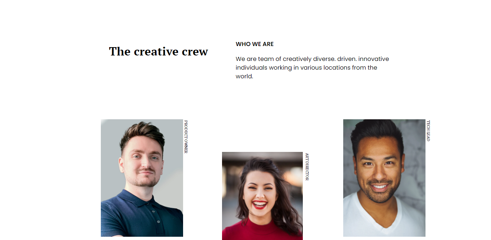

<!-- Please update value in the {}  -->

<h1 align="center">my team page by Hannah Relf</h1>

   Solution for a challenge from  <a href="http://devchallenges.io" target="_blank">Devchallenges.io</a>.

  <h3>
    <a href="https://jovial-darwin-e52fc4.netlify.app/">
      Demo
    </a>
     | 
    <a href="https://github.com/hannahrelf/my-team-page">
      Solution
    </a>
     | 
    <a href="https://devchallenges.io/challenges/hhmesazsqgKXrTkYkt0U">
      Challenge
    </a>
  </h3>

<!-- TABLE OF CONTENTS -->

## Table of Contents

- [Overview](#overview)
- [Features](#features)
- [Contact](#contact)

<!-- OVERVIEW -->

## Overview

This was very tricky, made using CSS grid, first time using it properly. Tried to make responsive for mobile devices, but I may have overcomplicated it!

## Features

<!-- List the features of your application or follow the template. Don't share the figma file here :) -->

This application/site was created as a submission to a [DevChallenges](https://devchallenges.io/challenges) challenge. The [challenge](https://devchallenges.io/challenges/hhmesazsqgKXrTkYkt0U) was to build an application to complete the given user stories.

## Contact

- Website [Hosted on Netlify](https://inspiring-booth-117a6e.netlify.app/)
- GitHub [@hannahrelf](https://github.com/hannahrelf)
- Twitter [@hannnahmr](https://twitter.com/hannnahmr)
